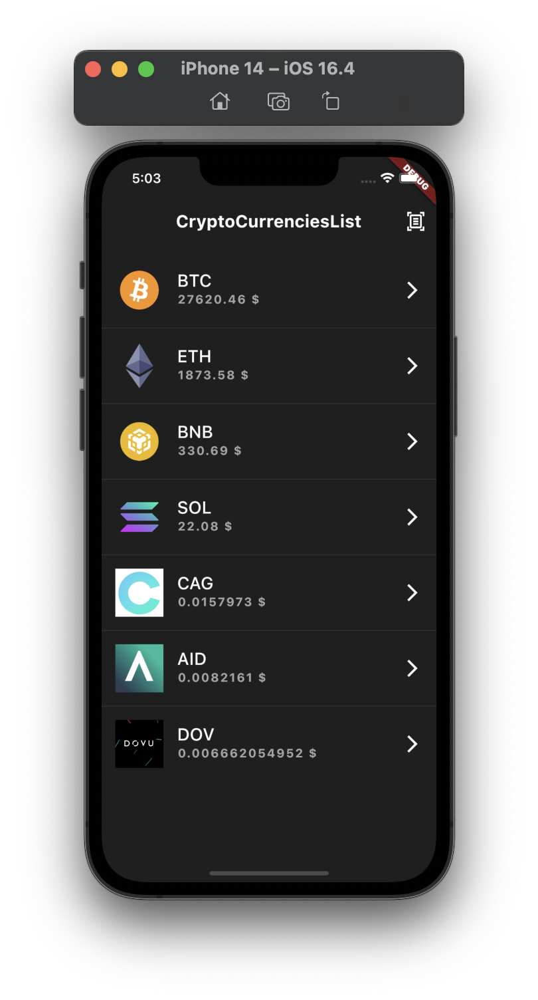
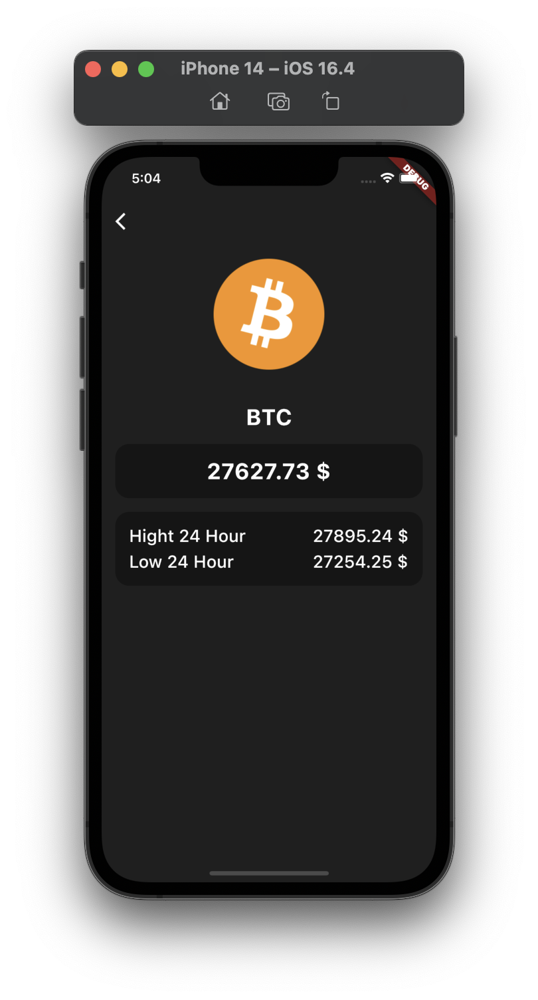
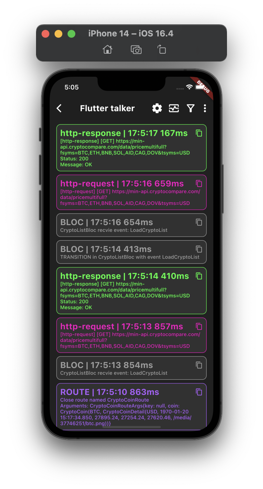

<h1 align="center"> Flutter с нуля до профи </h1>

Плейлист курса можно бесплатно посомтреть на <a href="https://www.youtube.com/playlist?list=PLtUuja72DaLIiIYLQP7rUjxItkDjHcSMw">youtube</a>

|  |  |  |
| :------------: | :------------: | :------------: |

В ходе курса, мы вместе разбираемся с тем, что такое Flutter и как на нем сделать первое приложение. В итоге курса можно сделать интересный crypto-app, которое работает с настоящим API проекта [CryptoCompare.com](https://min-api.cryptocompare.com/)

Научимся программировать на dart, узнаем про основные виджеты в Flutter, как работать с сетью http dio, узнаем про основной стейт менеджмент в Flutter - BLoC. 

А так же хранение данных локально с помощью Hive, генерация сериализации при работе с http используя библиотеки json_annotation, json_serializable. Удобная и генерируемая навигация используя бибилиотеку auto_route.

|  |  |
| :------------: | :------------: |
|  |  |
|  |  |
|  |  |
|  |  |
|  |  |
|  |  |
 |

## Базовый YouTube курс для Flutter разработчиков на русском языке